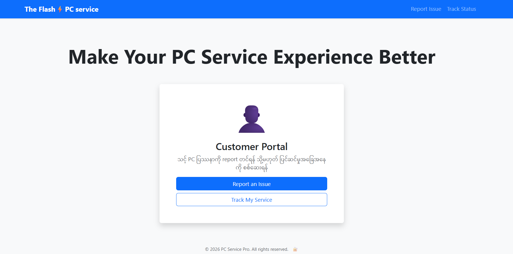
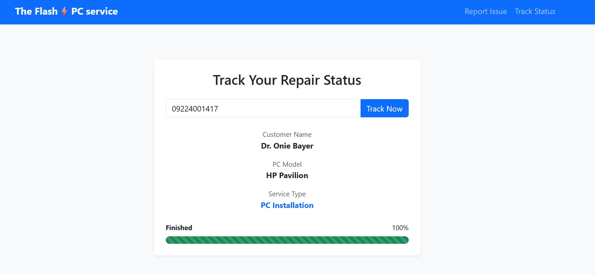
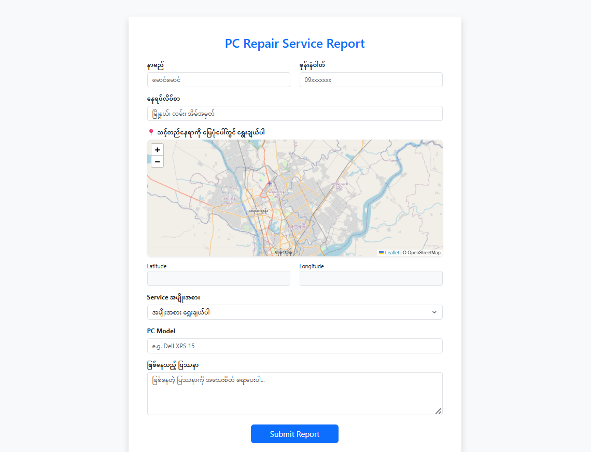
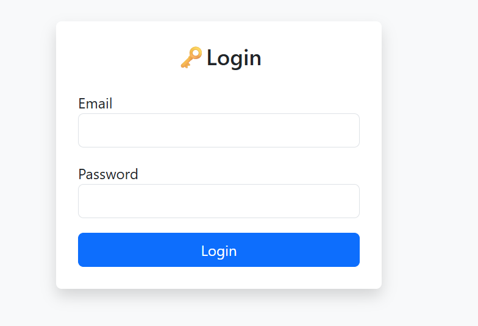
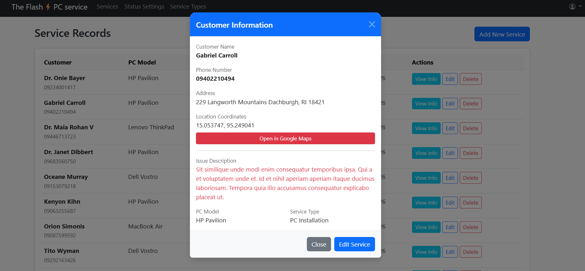

# 💻 PC Service Management System

A Laravel-based system for managing PC repair services with customer tracking and admin dashboard.

## ✨ Project Features

| 📋 Customer Reporting | 🔍 Real-time Tracking |
| :---: | :---: |
|  |  |
|  |

| Customer များ Report တင်ရန် | ဖုန်းနံပါတ်ဖြင့် အခြေအနေ စစ်ဆေးရန် |

| ⚙️ Admin Panel | 📍 Location Mapping | 🔐Auth
| :---: | :---: |
|  |  |
| ဝန်ဆောင်မှုများကို စီမံရန် | Customer တည်နေရာကို မြေပုံဖြင့်ကြည့်ရန် |

## 🛠 Tech Stack
* **Framework:** Laravel 11
* **Database:** MySQL
* **Frontend:** Bootstrap 5

## 🔧 Installation
1. `composer install`
2. `php artisan migrate --seed`
3. `php artisan serve`

## 📊 Status Flow
1. **New** - Initial report received.
2. **On Going** - Repair started.
3. **Processing** - Active repair work.
4. **Finished** - Ready for pickup.